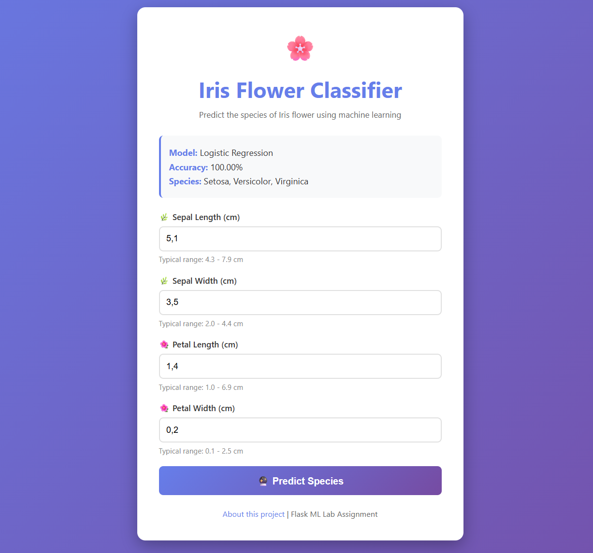

# 🌸 Iris Flower Classification Web App

A machine learning web application built with Flask that predicts the species of Iris flowers based on their physical measurements.

## 🎯 Overview

This Flask ML application demonstrates a complete workflow from data to deployment. It classifies Iris flowers into three species: **Setosa**, **Versicolor**, and **Virginica** based on physical measurements.

**Lab Assignment Completion:**
1. ✅ Dataset selected and prepared (Iris - 150 samples, 4 features, 3 classes)
2. ✅ Data preprocessing (missing values checked, features scaled with StandardScaler)
3. ✅ Relevant characteristics extracted (sepal/petal length & width)
4. ✅ Prediction form created with user-friendly web interface
5. ✅ Multiple ML models compared (4 algorithms evaluated)
6. ✅ Functional web application with REST API

## ✨ Features

- Interactive web form with input validation and real-time predictions
- Beautiful, responsive UI with confidence scores and probability visualization
- Comparison of 4 ML algorithms (Logistic Regression, Random Forest, SVM, KNN)
- REST API endpoint for programmatic access

## 📊 Dataset & Model Performance

**Dataset**: Iris (sklearn) - 150 samples, 4 features, 3 classes, no missing values

**Features**: Sepal Length, Sepal Width, Petal Length, Petal Width (all in cm)

**Model Comparison Results:**

| Model | Test Accuracy | Cross-Validation Score |
|-------|--------------|----------------------|
| **Logistic Regression** ⭐ | **100.00%** | **95.83% (±4.56%)** |
| Random Forest | 100.00% | 95.00% (±4.08%) |
| SVM | 100.00% | 95.00% (±6.12%) |
| K-Nearest Neighbors | 100.00% | 92.50% (±6.12%) |

**Selected**: Logistic Regression (best cross-validation performance)

## 🛠 Technologies

- Flask 3.0.0, Scikit-learn 1.3.2, NumPy 1.26.2, Pandas 2.1.3, Gunicorn 21.2.0

## 🚀 Quick Start

### Local Installation

```bash
# Navigate to project
cd Flask_Lab

# Install dependencies
pip install -r requirements.txt

# Train the model (if needed)
python prepare_model.py

# Run the application
python app.py
```

Access at: `http://localhost:5000`

### Quick Test Script

```bash
./start.sh  # Automated setup and launch
```

## 💻 Usage

**Web Interface**: Enter measurements → Click "Predict Species" → View results

**Test Examples:**
- Setosa: `5.1, 3.5, 1.4, 0.2`
- Versicolor: `5.9, 3.0, 4.2, 1.5`
- Virginica: `6.5, 3.0, 5.5, 1.8`

**REST API** (POST `/api/predict`):
```bash
curl -X POST http://localhost:5000/api/predict \
  -H "Content-Type: application/json" \
  -d '{"sepal_length":5.1,"sepal_width":3.5,"petal_length":1.4,"petal_width":0.2}'
```

Response: `{"prediction": "setosa", "confidence": 99.87, "probabilities": {...}}`


## 📸 Screenshots

### Home Page - Prediction Form


### Prediction Result Page


## 📁 Project Structure

```
Flask_Lab/
├── app.py                   # Flask application
├── prepare_model.py         # Model training script
├── model.pkl               # Trained model
├── scaler.pkl              # Feature scaler
├── model_metadata.json     # Model info
├── requirements.txt        # Dependencies
├── Procfile               # Heroku config
├── runtime.txt            # Python version
├── start.sh               # Quick launch script
├── templates/             # HTML templates
│   ├── index.html        # Home page
│   ├── result.html       # Results
│   ├── about.html        # About
│   └── error.html        # Error page
└── screenshots/          # App screenshots
```

---

**Built for Cloud & Big Data Course Lab Assignment**
